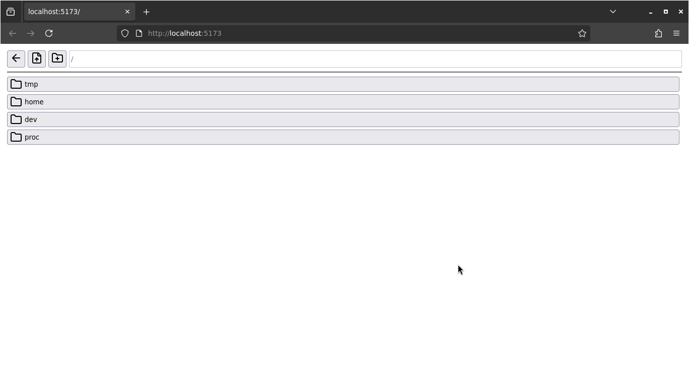

# emscripten-fs-file-explorer-ui

Standalone File Explorer UI for the [Emscripten](https://emscripten.org) virtual [filesystem](https://emscripten.org/docs/api_reference/Filesystem-API.html#filesystem-api) for using in the browser.

This may be useful if you have an existing project that uses Emscripten, such as a game, you can add this to let users explore and modify the file system.



## Installation

```bash
npm install emscripten-fs-file-explorer-ui
```

## Usage

```javascript
import mountEmscriptenFileExplorer from "emscripten-fs-file-explorer-ui";

async function main() {
  const emscriptenScript = await import("emscripten-script.js");
  const emscriptenModule = await emscriptenScript.default();

  const container = document.getElementById("emscripten-explorer");

  // Last param is the configuration options (Optional)
  mountEmscriptenFileExplorer(container, emscriptenModule.FS, {
    initialDir: "/home/web_user",
  });
}
```

If you are not using npm or a bundler you can download the standalone prebuilt files from the dist folder:

```html
<!DOCTYPE html>
<html>
  <head>
    <!-- Always use the .iife.js since it is minified and optimized for this use case -->
    <script src="./emscripten-fs-file-explorer-ui.iife.js"></script>
  </head>
  <body>
    <div id="explorer"></div>

    <script type="module">
      const emscriptenScript = await import("./emscripten-script.js");
      const emscriptenModule = await emscriptenScript.default();
      const container = document.getElementById("explorer");
      // This function is exposed as a global variable when using the .iife.js prebuilt file
      mountEmscriptenFileExplorer(container, emscriptenModule.FS, {
        initialDir: "/home/web_user",
      });
    </script>
  </body>
</html>
```

## Development

### Install dependencies

```bash
pnpm install
```

### Build

```bash
pnpm build
```

### Test

This will create a vite server with live reloading

```bash
pnpm dev
```

To test the build files you can start an http server and browse to the `test-build.html` file.

Check the `emscripten` folder to see the source of the emscripten script we are using for testing, basically it is just a script that prints one sentence, we are using -sFORCE_FILESYSTEM to force file system support on it, this is the full command for building it (assuming emscripten is on your $PATH as `emcc` and you are located inside `emscripten` folder):

```bash
emcc test-script.c -o test-script.js -sFORCE_FILESYSTEM -sEXPORTED_RUNTIME_METHODS=FS -sEXPORT_ES6
```

## License

This software is distributed under the [LGPL-3.0](LICENSE.txt) license.
